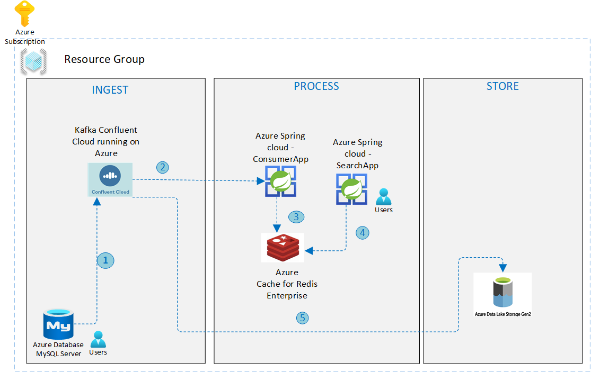

# Real-Time search use case: Powered by MySQL, Kafka and RediSearch on Azure

[Apache Kafka](https://kafka.apache.org/) often plays a key role in the overall data architecture with other systems producing/consuming data to/from it. These could be click stream events, logs, sensor data, database change-events etc. So, as you might imagine, there is a lot of data in Kafka (topics) but it’s useful only when consumed or ingested into other systems.

[Kafka Connect](https://kafka.apache.org/documentation/#connect) is a platform to stream data between Apache Kafka and external systems in a scalable and reliable manner. Thanks to connectors (sink/source), you do not need to write custom integration code to glue systems together. 

> In case an existing connector is not available, you can leverage the powerful [Kafka Connect framework](https://kafka.apache.org/documentation/#connect_development) to build your own connectors.

This example demonstrates a data pipeline, to synchronize data between MySQL and Redis. Although this is applicable to many use cases, the one being covered here is that of product/inventory information being available to downstream systems in near real-time to fulfill **search** requirements. 

**What's covered?**

- The high level solution architecture
- The end to end guide/how-to on how to deploy and test the entire solution on Azure

Imagine data being uploaded (using a batched mode for example) to a relational database ([MySQL on Azure](https://docs.microsoft.com/azure/mysql/overview?WT.mc_id=data-14444-abhishgu) in this case) - this can be continuously synchronized to a search engine with low latency - In this solution, [Redis on Azure](https://docs.microsoft.com/azure/azure-cache-for-redis/?WT.mc_id=data-14444-abhishgu) is used as the search engine (more on this soon). This provides a foundation for other services (such as APIs) to drive important parts of the business, such as a customer facing website that can provide fresh, up-to date information on products, availability etc.

## Solution architecture

This section provides a high level overview of the solution and the individual components.



As you can see, it has several moving parts:

- The infrastructure components that form the bedrock of the architecture
    - Apache Kafka: [Confluent Cloud Kafka cluster on Azure infrastructure](https://azure.microsoft.com/en-us/blog/introducing-seamless-integration-between-microsoft-azure-and-confluent-cloud/) (available via Azure Marketplace)
    - Redis: To be specific, we will be using the [RediSearch module](https://oss.redislabs.com/redisearch) which is supported in the [Enterprise Tier of Azure Cache for Redis](https://docs.microsoft.com/azure/azure-cache-for-redis/quickstart-create-redis-enterprise?WT.mc_id=data-14444-abhishgu)
    - MySQL database: Fully managed database as a service
    - Kafka Connect cluster with [MySQL source connector](https://docs.confluent.io/cloud/current/connectors/cc-mysql-source.html) (fully managed!)
- Application components: These are services running on [Azure Spring Cloud](https://docs.microsoft.com/azure/spring-cloud/spring-cloud-overview?WT.mc_id=data-14444-abhishgu)
    - Change Event Processor: A Java [Spring Boot](https://spring.io/projects/spring-boot) application that uses [Spring Kafka integration](https://spring.io/projects/spring-kafka).
    - Search application: Another Java Spring Boot app that exposes a REST API.

Thanks to the JDBC source connector, data in MySQL (`products` table) is sent to a Kafka topic - here is how the JSON payload looks like TODO:

```json

```

A consumer application processes these events and makes sure that they are available for search. It does so by creating the required index definition and [adding new product info as RediSearch documents](https://oss.redislabs.com/redisearch/Commands/#ftcreate) (currently represented as a Redis `HASH`). The search services then makes makes the RediSearch data available as a REST API. To keep things simple, the REST API allows you to enter queries as per the [RediSearch query syntax](https://oss.redislabs.com/redisearch/Query_Syntax/)

> The above mentioned services use the [JRediSearch library](https://github.com/RediSearch/JRediSearch) to interface with RediSearch to create index, add documents and querying.

## Pre-requisites

Before we dive into the nitty gritty, please ensure that you have:

- An Azure account. You can [get it for free](https://azure.microsoft.com/free/?WT.mc_id=data-14444-abhishgu) if you don't already have one.
- [Install Azure CLI](https://docs.microsoft.com/cli/azure/install-azure-cli?WT.mc_id=data-14444-abhishgu) to deploy and manage the infrastructure components.
- JDK 11 or above
- Recent [Maven](https://maven.apache.org/install.html) release
- Git

## Set up the base infrastructure components

- **MySQL instance**: Create an [Azure Database for MySQL server using the Azure CLI](https://docs.microsoft.com/azure/mysql/quickstart-create-mysql-server-database-using-azure-cli?WT.mc_id=data-14444-abhishgu) (or the [Azure portal](https://docs.microsoft.com/azure/mysql/quickstart-create-mysql-server-database-using-azure-portal?WT.mc_id=data-14444-abhishgu) if that's what you prefer)
- **Apache Kafka cluster**: [Use the Azure portal](https://docs.microsoft.com/azure/partner-solutions/apache-kafka-confluent-cloud/create?WT.mc_id=data-14444-abhishgu) to create an instance of Apache Kafka for Confluent Cloud.
- **Azure Cache for Redis**: Use the Azure portal to [create a Redis Enterprise cache instance](https://docs.microsoft.com/azure/azure-cache-for-redis/quickstart-create-redis-enterprise?WT.mc_id=data-14444-abhishgu).
- **Azure Spring Cloud**: [Provision an instance of Azure Spring Cloud](https://docs.microsoft.com/azure/spring-cloud/spring-cloud-quickstart?tabs=Azure-CLI&pivots=programming-language-java&WT.mc_id=data-14444-abhishgu#provision-an-instance-of-azure-spring-cloud) using the Azure portal.

### You also need to configure

**MySQL instance on Azure**

- [Configure firewall rules](https://docs.microsoft.com/azure/mysql/howto-manage-firewall-using-portal?WT.mc_id=data-14444-abhishgu) to allow public inbound traffic access (`0.0.0.0/0`).
- Ensure that a specific [database timezone is set](https://docs.microsoft.com/azure/mysql/howto-server-parameters?WT.mc_id=data-14444-abhishgu#working-with-the-time-zone-parameter).
- Create a table (`products`) in MySQL - you can use a client like [MySQL workbench](https://docs.microsoft.com/azure/mysql/connect-workbench?WT.mc_id=data-14444-abhishgu)

```sql
CREATE TABLE `products` (
  `product_id` int(11) NOT NULL,
  `product_name` varchar(255) NOT NULL,
   `created_at`timestamp NOT NULL,
  `product_details` JSON DEFAULT NULL,
  
  PRIMARY KEY (`product_id`)
);
```

> For details, please refer to the [Prerequisites section in the connector documentation](https://docs.confluent.io/cloud/current/connectors/cc-mysql-source.html)

**Kafka cluster in Confluent Cloud**

- (optional) Create topic: The connector automatically creates a topic (based on default convention). Create the topic manually if you want to override it's default settings (please make sure to use the same topic name while configuring the connector)
- [Configure and launch the MySQL source connector using the portal](https://docs.confluent.io/cloud/current/connectors/cc-mysql-source.html#step-2-add-a-connector).

> Before you move ahead, make sure that the basic stuff is working - insert record in MySQL and [ensure that the Kafka topic is getting the messages](https://docs.confluent.io/cloud/current/connectors/cc-mysql-source.html#step-7-check-the-ak-topic).

For Redis instance on Azure, please ensure you have the host name and the access keys information handy.

## Build and deploy applications to Azure Spring Cloud

Start by cloning the GitHub repository and change into right directory:

```bash
git clone https://github.com/Azure-Samples/mysql-kafka-redis-integration
cd mysql-kafka-redis-integration
```

For both the services, update the `application.yaml` file in `src/main/resources` folder with connection details for Azure Cache for Redis and the Confluent Cloud Kafka cluster. 

Here is a trimmed down version for the Change Events Processor service:

```yaml
redis:
  host: <enter redis host>
  port: <enter redis port>
  password: <enter redis access key>
topic:
  name: <topic name e.g. myserver.products>
  partitions-num: 6
  replication-factor: 3
spring:
  kafka:
    bootstrap-servers:
      - <kafka bootstrap server>
    properties:
      ssl.endpoint.identification.algorithm: https
      sasl.mechanism: PLAIN
      request.timeout.ms: 20000
      retry.backoff.ms: 500
      sasl.jaas.config: org.apache.kafka.common.security.plain.PlainLoginModule required username="<enter kafka API key>" password="<enter kafka API secret>";
      security.protocol: SASL_SSL
...
```

The config for the Search API service is quite compact:

```yaml
redis:
  host: <enter redis host>
  port: <enter redis port>
  password: <enter redis access key>
```

Build JAR files for the Spring applications:

```bash
export JAVA_HOME=<enter path to JDK e.g. /Library/Java/JavaVirtualMachines/zulu-11.jdk/Contents/Home>

# Change Events Processor service
mvn clean package -f change-events-processor/pom.xml

# Search API service
mvn clean package -f search-api/pom.xml
```

Install the Azure Spring Cloud [extension for Azure CLI](https://docs.microsoft.com/cli/azure/extension?view=azure-cli-latest&WT.mc_id=data-14444-abhishgu):

```bash
az extension add --name spring-cloud
```

[Create the Azure Spring Cloud applications](https://docs.microsoft.com/cli/azure/ext/spring-cloud/spring-cloud/app?view=azure-cli-latest&WT.mc_id=data-14444-abhishgu#ext_spring_cloud_az_spring_cloud_app_create) corresponding to both the services:

```bash
# Change Events Processor service
az spring-cloud app create -n change-events-processor -s <enter the name of Azure Spring Cloud service instance> -g <enter azure resource group name> --runtime-version Java_11

# Search API service
az spring-cloud app create -n search-api -s <enter the name of Azure Spring Cloud service instance> -g <enter azure resource group name> --runtime-version Java_11 --is-public true
```

[Deploy the JAR files](https://docs.microsoft.com/cli/azure/ext/spring-cloud/spring-cloud/app?view=azure-cli-latest&WT.mc_id=data-14444-abhishgu#ext_spring_cloud_az_spring_cloud_app_deploy) for the respective applications you just created:

```bash
# for the Change Events Processor service
az spring-cloud app deploy -n change-events-processor -s <enter the name of Azure Spring Cloud service instance> -g <enter azure resource group name> --jar-path change-events-processor/target/change-events-processor-0.0.1-SNAPSHOT.jar

# for the Search API service
az spring-cloud app deploy -n search-api -s <enter the name of Azure Spring Cloud service instance> -g <enter azure resource group name> --jar-path search-api/target/search-api-0.0.1-SNAPSHOT.jar
```

## Time to see real time search in action!

Now that we have all the components in place, we can test the end to end functionality. It's quite simple:

- Add new product data to the MySQL database
- Use the Search app to make sure it has propagated all the way to Redis

Insert random product data:

```sql
INSERT INTO `products` VALUES (42, 'Outdoor chairs', NOW(), '{"brand": "Mainstays", "description": "Mainstays Solid Turquoise 72 x 21 in. Outdoor Chaise Lounge Cushion", "tags": ["Self ties cushion", "outdoor chairs"], "categories": ["Garden"]}');

INSERT INTO `products` VALUES (43, 'aPhone', NOW(), '{"brand": "Orange", "description": "An inexpensive phone", "tags": ["electronics", "mobile phone"], "categories": ["Electronics"]}');

```

Get the URL for Search API service - use the portal or the [CLI as such](https://docs.microsoft.com/cli/azure/ext/spring-cloud/spring-cloud/app?view=azure-cli-latest&WT.mc_id=data-14444-abhishgu#ext_spring_cloud_az_spring_cloud_app_show):

```bash
az spring-cloud app show -n search-api -s <enter the name of Azure Spring Cloud service instance> -g <enter azure resource group name>
```

Use `curl` or another HTTP client to invoke the Search API. Each of these queries will return results in form of a JSON payload as such:

```json
[
    {
        "created": "1614235666000",
        "name": "Outdoor chairs",
        "description": "Mainstays Solid Turquoise 72 x 21 in. Outdoor Chaise Lounge Cushion",
        "id": "42",
        "categories": "Garden",
        "brand": "Mainstays",
        "tags": "Self ties cushion, outdoor chairs"
    },
    {
        "created": "1614234718000",
        "name": "aPhone",
        "description": "An inexpensive phone",
        "id": "43",
        "categories": "Electronics",
        "brand": "Orange",
        "tags": "electronics, mobile phone"
    }
]
```

Here are a few examples to get you started. Note that the query parameter `q` is used to specify the [RediSearch query](https://oss.redislabs.com/redisearch/Query_Syntax/).

```bash
# search for all records
curl <search api URL>/search?q=*

# search for products by name
curl <search api URL>/search?q=@name:Outdoor chairs

# search for products by category
curl <search api URL>/search?q=@categories:{Garden | Electronics}

# search for products by brand
curl <search api URL>/search?q=@brand:Mainstays

# apply multiple search criteria
curl <search api URL>/search?q=@categories:{Electronics} @brand:Orange
```

> You can continue to add more product information and check the pipeline.

Other things you might want to try:

- Confirm that information is flowing to the [Kafka topic in Confluent Cloud](https://docs.confluent.io/cloud/current/connectors/cc-mysql-source.html#step-7-check-the-ak-topic)
- [Check the logs for the consumer application](https://docs.microsoft.com/cli/azure/ext/spring-cloud/spring-cloud/app?view=azure-cli-latest&WT.mc_id=data-14444-abhishgu#ext_spring_cloud_az_spring_cloud_app_logs) deployed to Azure Spring Cloud - this will give a sneak peek into the records that are getting processed (use `az spring-cloud app logs -n <app name> -s <service name> -g <resource group>`)
- Take a look at the [RediSearch Query Syntax](https://oss.redislabs.com/redisearch/Query_Syntax/) and try other queries as well.
- Connect to the Azure Cache for Redis instance and run the RediSearch queries directly - just to double check.

Connect using `redis-cli` as such:

```bash
redis-cli -h <enter host name> -p <enter port i.e. 10000> -a <enter redis password/access key> --tls
```

## Exporting data to Azure Data Lake

If you want to store this data to Azure Data Lake Storage for longer term (cold), the [ADLS Gen2 connector](https://docs.confluent.io/cloud/current/connectors/cc-azure-datalakeGen2-storage-sink.html) for Kafka has you covered. For our scenario, we already have product data flowing into the Kafka topic in Confluent Cloud on Azure - all we need to do configure the connector to get the job done.

> And guess what, that's available as a fully-managed offering as well!

Here is what you need to do:

- [Create a storage account](https://docs.microsoft.com/azure/storage/blobs/create-data-lake-storage-account?WT.mc_id=data-14444-abhishgu)
- Configure the connector and start it. Please make sure to use the same topic name as you did before (e.g. `myserver.products`)
- Confirm that the data was exported to the Azure storage container in the ADLS account.

> For a step by step guide, please [follow the documentation](https://docs.confluent.io/cloud/current/connectors/cc-azure-datalakeGen2-storage-sink.html#quick-start)

## Clean up

Once you're done, make sure to delete the services to so that you do not incur unwanted costs. If they in the same resource group, simply [deleting the resource group](https://docs.microsoft.com/azure/azure-resource-manager/management/delete-resource-group?tabs=azure-portal&WT.mc_id=data-14444-abhishgu#delete-resource-group) will suffice. You can also delete the resources (MySQL, Confluent Cloud organization, Redis and Azure Spring Cloud instance) individually.

## Conclusion

You learnt about the high level architecture and the complete guide on how to run the solution on Azure. Also, the entire solution was based on managed PaaS services. This offers a significant benefit since you don't have to setup and maintain complex distributed systems such as a database, streaming platform and runtime infrastructure for your Spring Boot Java apps.

Please note that this is just a part of a potentially larger use case. Thanks to Kafka, you can extend this to integrate with other systems as well, for example, [Azure Data Lake](https://docs.microsoft.com/azure/storage/blobs/data-lake-storage-introduction?WT.mc_id=data-14444-abhishgu) using (yet another fully managed!) the [ADLS Gen2 connector](https://docs.confluent.io/cloud/current/connectors/cc-azure-datalakeGen2-storage-sink.html).

### Want to learn more?

The following resources might be helpful:

- [Get started with Apache Kafka for Confluent Cloud] (https://docs.microsoft.com/en-us/azure/partner-solutions/apache-kafka-confluent-cloud/create)
- [How to configure clustering in Azure Cache for Redis](https://docs.microsoft.com/en-us/azure/azure-cache-for-redis/cache-how-to-premium-clustering)
- [How to configure active geo-replication](https://docs.microsoft.com/azure/azure-cache-for-redis/cache-how-to-active-geo-replication?WT.mc_id=data-14444-abhishgu) in Enterprise Azure Cache for Redis instances
- [Azure Spring Cloud reference architecture](https://docs.microsoft.com/azure/spring-cloud/spring-cloud-reference-architecture?WT.mc_id=data-14444-abhishgu)
- [Setup Service Discovery for your Spring Cloud microservices](https://docs.microsoft.com/azure/spring-cloud/spring-cloud-service-registration?pivots=programming-language-java&WT.mc_id=data-14444-abhishgu)
- [Choose the right MySQL Server option in Azure](https://docs.microsoft.com/azure/mysql/select-right-deployment-type?WT.mc_id=data-14444-abhishgu)
- [Migrate your MySQL database by using import and export](https://docs.microsoft.com/azure/mysql/concepts-migrate-import-export?WT.mc_id=data-14444-abhishgu)
